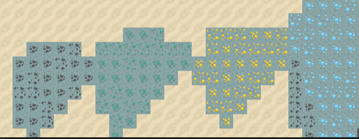
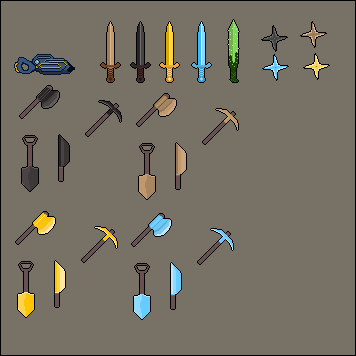
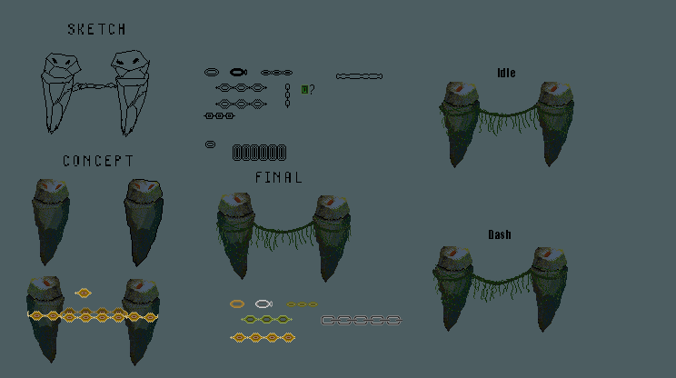

Hello I'm Duong

Passionate about 2D game development with Unity and C#.  
Experienced in gameplay, AI, and pixel art using Aseprite.

Some of my past pixel art work:

Concept art:

🔹 Project: [Mirror – 2D Survivor-like Game](https://github.com/verylowpower/Mirror)  
    
Demo: [YouTube Video](https://youtu.be/o3yGVmpuUgw)
    
🔹 Art: [ArtStation](https://www.artstation.com/yeloathsome9)  
📧 tduongpf@gmail.com
