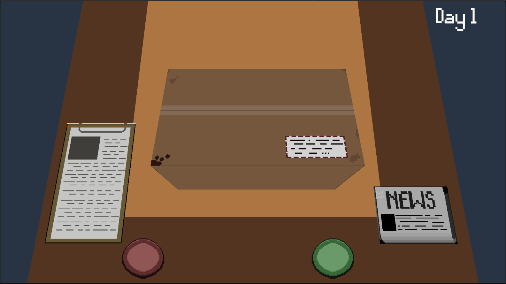

Hello I'm Duong

Passionate about 2D and 3D game development with Unity and C#.  

Experienced in gameplay, AI, and pixel art using Aseprite.

🔹 Project: [Mirror – 2D  BulletHell Game](https://github.com/verylowpower/Mirror)  (In Development)

Implemented spatial partitioning system to manage enemy spawning and AI updates efficiently.

Level up by collecting buffs and transform into a more powerful version.

Demo gameplay: [Mirror Demo GamePlay](https://ye-loathsome.itch.io/mirror)

_Still actively working on this project and updating regularly._

🔹 Project: [Customs - 3D Puzzle game](https://github.com/verylowpower/Customs)  (In Development)

Demo gameplay: [Customs](https://ye-loathsome.itch.io/customs)

You are a frontline customs officer in a world on the brink of war. Inspect package, uncover infiltration plots, and make life-or-death decisions. The fate of the nation rests in your hands.

🔹 Project: [Solitaire - 2D Mobile Card game](https://github.com/verylowpower/Solitaire_card_game)  (In Development)

A mobile Solitaire game

🔹 Some of my past pixel art work:

Asset:

In-game footage:

Concept art:

   
🔹 Art: [ArtStation](https://www.artstation.com/yeloathsome9)  
Email: tduongpf@gmail.com
